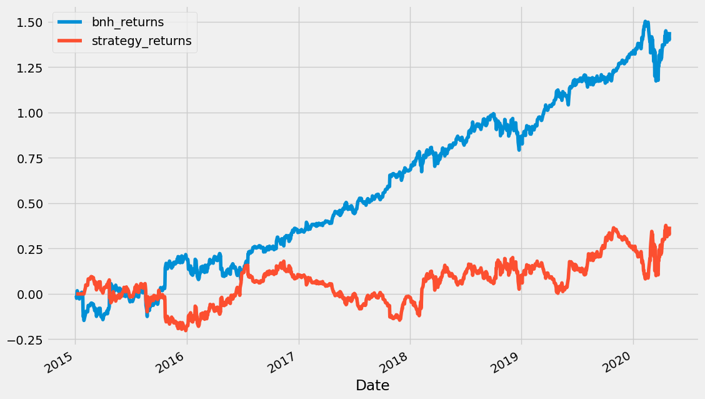
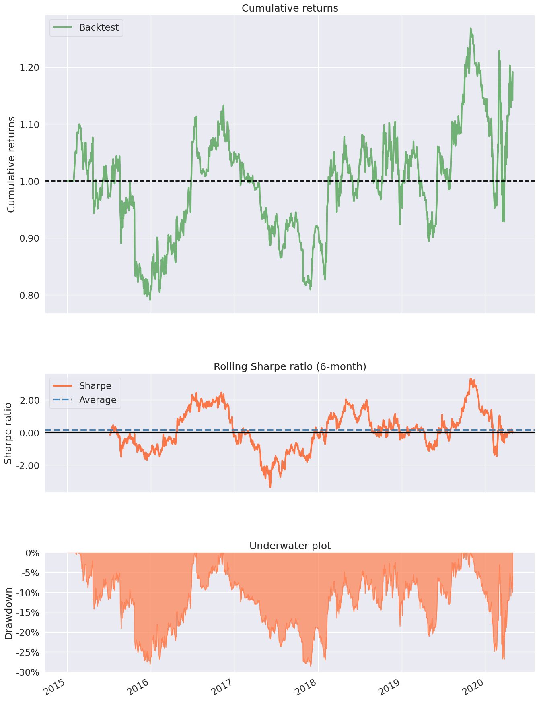

```python
#https://blog.devgenius.io/algorithmic-trading-backtesting-a-strategy-in-python-3a136be16ece
```


```python
# Importing necessary libraries
import pandas as pd
import numpy as np
import matplotlib.pyplot as plt
import yfinance as yf
import pyfolio as pf
import datetime as dt
import pandas_datareader.data as web
import os
import warnings

# Ignore printing all warnings
warnings.filterwarnings('ignore')

# print all outputs
from IPython.core.interactiveshell import InteractiveShell
InteractiveShell.ast_node_interactivity = "all"
```


```python
# downloading historical necessary data for backtesting and analysis
_start = dt.date(2015,1,2)
_end = dt.date(2020,4,30)
ticker = 'MSFT'
df = yf.download(ticker, start = _start, end = _end)
```

    [*********************100%***********************]  1 of 1 completed
    


```python
# calculating buy and hold strategy returns
df['bnh_returns'] = np.log(df['Adj Close']/df['Adj Close'].shift(1))
df.head(3)
```


<div>
<style scoped>
    .dataframe tbody tr th:only-of-type {
        vertical-align: middle;
    }

    .dataframe tbody tr th {
        vertical-align: top;
    }

    .dataframe thead th {
        text-align: right;
    }
</style>
<table border="1" class="dataframe">
  <thead>
    <tr style="text-align: right;">
      <th></th>
      <th>Open</th>
      <th>High</th>
      <th>Low</th>
      <th>Close</th>
      <th>Adj Close</th>
      <th>Volume</th>
      <th>bnh_returns</th>
    </tr>
    <tr>
      <th>Date</th>
      <th></th>
      <th></th>
      <th></th>
      <th></th>
      <th></th>
      <th></th>
      <th></th>
    </tr>
  </thead>
  <tbody>
    <tr>
      <th>2015-01-02</th>
      <td>46.660000</td>
      <td>47.419998</td>
      <td>46.540001</td>
      <td>46.759998</td>
      <td>40.926449</td>
      <td>27913900</td>
      <td>NaN</td>
    </tr>
    <tr>
      <th>2015-01-05</th>
      <td>46.369999</td>
      <td>46.730000</td>
      <td>46.250000</td>
      <td>46.330002</td>
      <td>40.550087</td>
      <td>39673900</td>
      <td>-0.009239</td>
    </tr>
    <tr>
      <th>2015-01-06</th>
      <td>46.380001</td>
      <td>46.750000</td>
      <td>45.540001</td>
      <td>45.650002</td>
      <td>39.954922</td>
      <td>36447900</td>
      <td>-0.014786</td>
    </tr>
  </tbody>
</table>
</div>


```python
# creating bollinger band indicators
df['ma20'] = df['Adj Close'].rolling(window=20).mean()
df['std'] = df['Adj Close'].rolling(window=20).std()
df['upper_band'] = df['ma20'] + (2 * df['std'])
df['lower_band'] = df['ma20'] - (2 * df['std'])
df.drop(['Open','High','Low'],axis=1,inplace=True,errors='ignore')
df.tail(5)
```


<div>
<style scoped>
    .dataframe tbody tr th:only-of-type {
        vertical-align: middle;
    }

    .dataframe tbody tr th {
        vertical-align: top;
    }

    .dataframe thead th {
        text-align: right;
    }
</style>
<table border="1" class="dataframe">
  <thead>
    <tr style="text-align: right;">
      <th></th>
      <th>Close</th>
      <th>Adj Close</th>
      <th>Volume</th>
      <th>bnh_returns</th>
      <th>ma20</th>
      <th>std</th>
      <th>upper_band</th>
      <th>lower_band</th>
    </tr>
    <tr>
      <th>Date</th>
      <th></th>
      <th></th>
      <th></th>
      <th></th>
      <th></th>
      <th></th>
      <th></th>
      <th></th>
    </tr>
  </thead>
  <tbody>
    <tr>
      <th>2020-04-23</th>
      <td>171.419998</td>
      <td>167.577637</td>
      <td>32790800</td>
      <td>-0.012176</td>
      <td>161.229690</td>
      <td>8.549662</td>
      <td>178.329014</td>
      <td>144.130366</td>
    </tr>
    <tr>
      <th>2020-04-24</th>
      <td>174.550003</td>
      <td>170.637482</td>
      <td>34277600</td>
      <td>0.018095</td>
      <td>162.131024</td>
      <td>8.543421</td>
      <td>179.217866</td>
      <td>145.044182</td>
    </tr>
    <tr>
      <th>2020-04-27</th>
      <td>174.050003</td>
      <td>170.148697</td>
      <td>33194400</td>
      <td>-0.002869</td>
      <td>163.321234</td>
      <td>7.859113</td>
      <td>179.039460</td>
      <td>147.603008</td>
    </tr>
    <tr>
      <th>2020-04-28</th>
      <td>169.809998</td>
      <td>166.003723</td>
      <td>34392700</td>
      <td>-0.024663</td>
      <td>163.789497</td>
      <td>7.717711</td>
      <td>179.224920</td>
      <td>148.354074</td>
    </tr>
    <tr>
      <th>2020-04-29</th>
      <td>177.429993</td>
      <td>173.452881</td>
      <td>51286600</td>
      <td>0.043896</td>
      <td>164.753393</td>
      <td>7.657327</td>
      <td>180.068046</td>
      <td>149.438740</td>
    </tr>
  </tbody>
</table>
</div>


```python
# BUY condition
df['signal'] = np.where((df['Adj Close'] < df['lower_band']) &
                        (df['Adj Close'].shift(1) >=       df['lower_band']),1,0)

# SELL condition
df['signal'] = np.where( (df['Adj Close'] > df['upper_band']) &
                          (df['Adj Close'].shift(1) <= df['upper_band']),-1,df['signal'])
# creating long and short positions 
df['position'] = df['signal'].replace(to_replace=0, method='ffill')

# shifting by 1, to account of close price return calculations
df['position'] = df['position'].shift(1)

# calculating stretegy returns
df['strategy_returns'] = df['bnh_returns'] * (df['position'])

df.tail(5)
```


<div>
<style scoped>
    .dataframe tbody tr th:only-of-type {
        vertical-align: middle;
    }

    .dataframe tbody tr th {
        vertical-align: top;
    }

    .dataframe thead th {
        text-align: right;
    }
</style>
<table border="1" class="dataframe">
  <thead>
    <tr style="text-align: right;">
      <th></th>
      <th>Close</th>
      <th>Adj Close</th>
      <th>Volume</th>
      <th>bnh_returns</th>
      <th>ma20</th>
      <th>std</th>
      <th>upper_band</th>
      <th>lower_band</th>
      <th>signal</th>
      <th>position</th>
      <th>strategy_returns</th>
    </tr>
    <tr>
      <th>Date</th>
      <th></th>
      <th></th>
      <th></th>
      <th></th>
      <th></th>
      <th></th>
      <th></th>
      <th></th>
      <th></th>
      <th></th>
      <th></th>
    </tr>
  </thead>
  <tbody>
    <tr>
      <th>2020-04-23</th>
      <td>171.419998</td>
      <td>167.577637</td>
      <td>32790800</td>
      <td>-0.012176</td>
      <td>161.229690</td>
      <td>8.549662</td>
      <td>178.329014</td>
      <td>144.130366</td>
      <td>0</td>
      <td>1.0</td>
      <td>-0.012176</td>
    </tr>
    <tr>
      <th>2020-04-24</th>
      <td>174.550003</td>
      <td>170.637482</td>
      <td>34277600</td>
      <td>0.018095</td>
      <td>162.131024</td>
      <td>8.543421</td>
      <td>179.217866</td>
      <td>145.044182</td>
      <td>0</td>
      <td>1.0</td>
      <td>0.018095</td>
    </tr>
    <tr>
      <th>2020-04-27</th>
      <td>174.050003</td>
      <td>170.148697</td>
      <td>33194400</td>
      <td>-0.002869</td>
      <td>163.321234</td>
      <td>7.859113</td>
      <td>179.039460</td>
      <td>147.603008</td>
      <td>0</td>
      <td>1.0</td>
      <td>-0.002869</td>
    </tr>
    <tr>
      <th>2020-04-28</th>
      <td>169.809998</td>
      <td>166.003723</td>
      <td>34392700</td>
      <td>-0.024663</td>
      <td>163.789497</td>
      <td>7.717711</td>
      <td>179.224920</td>
      <td>148.354074</td>
      <td>0</td>
      <td>1.0</td>
      <td>-0.024663</td>
    </tr>
    <tr>
      <th>2020-04-29</th>
      <td>177.429993</td>
      <td>173.452881</td>
      <td>51286600</td>
      <td>0.043896</td>
      <td>164.753393</td>
      <td>7.657327</td>
      <td>180.068046</td>
      <td>149.438740</td>
      <td>0</td>
      <td>1.0</td>
      <td>0.043896</td>
    </tr>
  </tbody>
</table>
</div>


```python
# comparing buy & hold strategy / bollinger bands strategy returns
print("Buy and hold returns:",df['bnh_returns'].cumsum()[-1])
print("Strategy returns:",df['strategy_returns'].cumsum()[-1])

# plotting strategy historical performance over time
df[['bnh_returns','strategy_returns']] = df[['bnh_returns','strategy_returns']].cumsum()
df[['bnh_returns','strategy_returns']].plot(grid=True, figsize=(12, 8))
```

    Buy and hold returns: 1.4441294579285486
    Strategy returns: 0.37122462261240985
    


    <AxesSubplot: xlabel='Date'>


    

    


```python
pf.create_simple_tear_sheet(df['strategy_returns'].diff())
```


<table border="1" class="dataframe">
  <thead>
    <tr style="text-align: right;"><th>Start date</th><td colspan=2>2015-01-02</td></tr>
    <tr style="text-align: right;"><th>End date</th><td colspan=2>2020-04-29</td></tr>
    <tr style="text-align: right;"><th>Total months</th><td colspan=2>63</td></tr>
    <tr style="text-align: right;">
      <th></th>
      <th>Backtest</th>
    </tr>
  </thead>
  <tbody>
    <tr>
      <th>Annual return</th>
      <td>3.3%</td>
    </tr>
    <tr>
      <th>Cumulative returns</th>
      <td>19.1%</td>
    </tr>
    <tr>
      <th>Annual volatility</th>
      <td>27.1%</td>
    </tr>
    <tr>
      <th>Sharpe ratio</th>
      <td>0.26</td>
    </tr>
    <tr>
      <th>Calmar ratio</th>
      <td>0.12</td>
    </tr>
    <tr>
      <th>Stability</th>
      <td>0.16</td>
    </tr>
    <tr>
      <th>Max drawdown</th>
      <td>-28.6%</td>
    </tr>
    <tr>
      <th>Omega ratio</th>
      <td>1.05</td>
    </tr>
    <tr>
      <th>Sortino ratio</th>
      <td>0.37</td>
    </tr>
    <tr>
      <th>Skew</th>
      <td>NaN</td>
    </tr>
    <tr>
      <th>Kurtosis</th>
      <td>NaN</td>
    </tr>
    <tr>
      <th>Tail ratio</th>
      <td>1.16</td>
    </tr>
    <tr>
      <th>Daily value at risk</th>
      <td>-3.4%</td>
    </tr>
  </tbody>
</table>


    

    


```python

```
