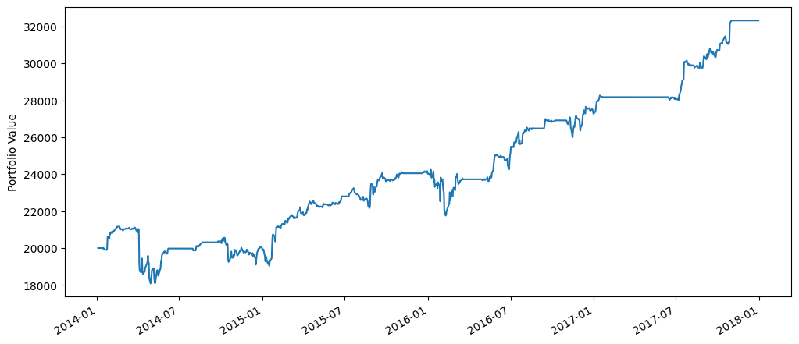
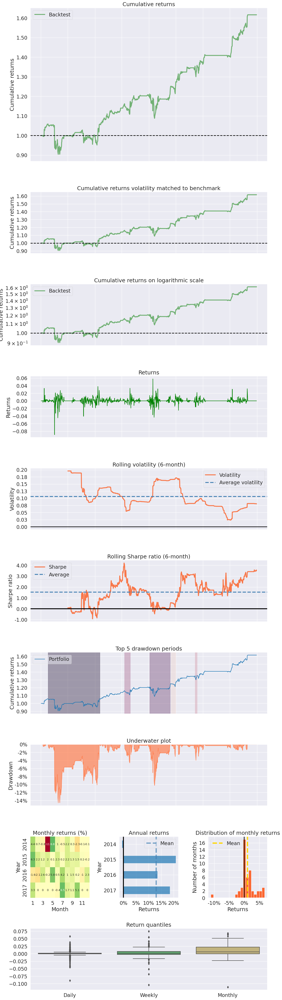
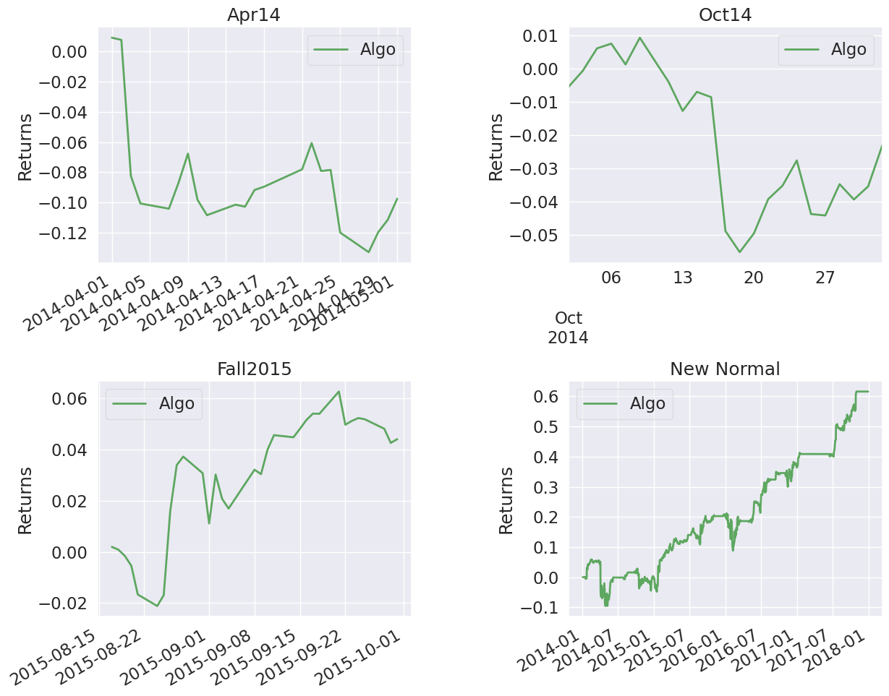
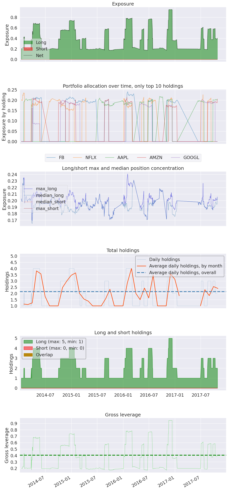
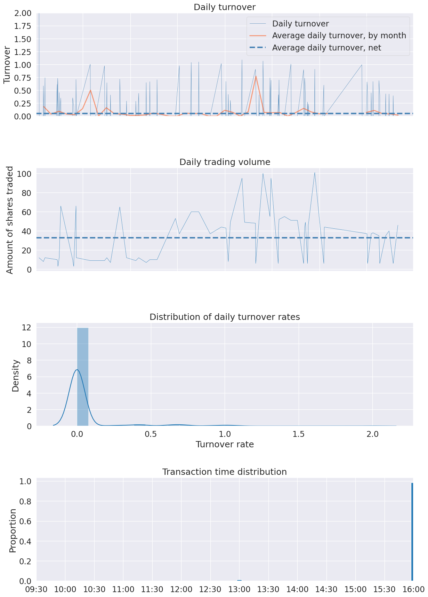

```python
%matplotlib inline
%load_ext zipline
```


```python
# !zipline run -f ../zipline/examples/buyapple.py --start 2016-1-1 --end 2018-1-1 -o buyapple_out.pickle --no-benchmark
# Jupyter에서 하면 에러나는데, CLI해서 하면 됩니다. pickle파일로 나오기때문에 그건 Jupyter에서 하면 됩니다.

#buyapple.py
%%zipline --start=2011-1-1 --end=2013-1-1 --no-benchmark

from zipline.api import order, record, symbol
import matplotlib.pyplot as plt

def initialize(context):
    pass

def handle_data(context, data):
    order(symbol('AAPL'), 10)
    record(AAPL=data.current(symbol('AAPL'), "price"))
    
def analyze(context, perf):
    ax1 = plt.subplot(211)
    perf.portfolio_value.plot(ax=ax1)
    ax2 = plt.subplot(212, sharex=ax1)
    perf.AAPL.plot(ax=ax2)
    plt.gcf().set_size_inches(18, 8)
    plt.show()
```


    ---------------------------------------------------------------------------

    TypeError                                 Traceback (most recent call last)

    ~\AppData\Local\Temp\tmp6t4b9xh3\ipykernel_22956\279227174.py in <module>
    ----> 1 get_ipython().run_cell_magic('zipline', '--start=2011-1-1 --end=2013-1-1 --no-benchmark', '\nfrom zipline.api import order, record, symbol\nimport matplotlib.pyplot as plt\n\ndef initialize(context):\n    pass\n\ndef handle_data(context, data):\n    order(symbol(\'AAPL\'), 10)\n    record(AAPL=data.current(symbol(\'AAPL\'), "price"))\n    \ndef analyze(context, perf):\n    ax1 = plt.subplot(211)\n    perf.portfolio_value.plot(ax=ax1)\n    ax2 = plt.subplot(212, sharex=ax1)\n    perf.AAPL.plot(ax=ax2)\n    plt.gcf().set_size_inches(18, 8)\n    plt.show()\n')
    

    D:\Users\HB Private\anaconda3\envs\env_zipline\lib\site-packages\IPython\core\interactiveshell.py in run_cell_magic(self, magic_name, line, cell)
       2417             with self.builtin_trap:
       2418                 args = (magic_arg_s, cell)
    -> 2419                 result = fn(*args, **kwargs)
       2420             return result
       2421 
    

    D:\Users\HB Private\anaconda3\envs\env_zipline\lib\site-packages\zipline\__main__.py in zipline_magic(line, cell)
        326 def zipline_magic(line, cell=None):
        327     """The zipline IPython cell magic."""
    --> 328     load_extensions(
        329         default=True,
        330         extensions=[],
    

    D:\Users\HB Private\anaconda3\envs\env_zipline\lib\site-packages\zipline\utils\run_algo.py in load_extensions(default, extensions, strict, environ, reload)
        287                 with open(ext) as f:
        288                     ns = {}
    --> 289                     exec(compile(f.read(), ext, "exec"), ns, ns)
        290             else:
        291                 __import__(ext)
    

    ~/.zipline\extension.py in <module>
         66 
         67 from zipline.data.bundles import iex
    ---> 68 import trading_calendars as tc
         69 
         70 cal=tc.get_calendar('NYSE')
    

    D:\Users\HB Private\anaconda3\envs\env_zipline\lib\site-packages\trading_calendars\__init__.py in <module>
         14 # limitations under the License.
         15 
    ---> 16 from .trading_calendar import TradingCalendar
         17 from .calendar_utils import (
         18     clear_calendars,
    

    D:\Users\HB Private\anaconda3\envs\env_zipline\lib\site-packages\trading_calendars\trading_calendar.py in <module>
         31 import toolz
         32 
    ---> 33 from .calendar_helpers import (
         34     NP_NAT,
         35     compute_all_minutes,
    

    D:\Users\HB Private\anaconda3\envs\env_zipline\lib\site-packages\trading_calendars\calendar_helpers.py in <module>
          4 NANOSECONDS_PER_MINUTE = int(6e10)
          5 
    ----> 6 NP_NAT = np.array([pd.NaT], dtype=np.int64)[0]
          7 
          8 
    

    TypeError: int() argument must be a string, a bytes-like object or a number, not 'NaTType'


```python
import pandas as pd
pd.set_option('display.max_columns', None)

perf = pd.read_pickle('perf(ex).pickle') # read in perf DataFrame
perf.head()
```


<div>
<style scoped>
    .dataframe tbody tr th:only-of-type {
        vertical-align: middle;
    }

    .dataframe tbody tr th {
        vertical-align: top;
    }

    .dataframe thead th {
        text-align: right;
    }
</style>
<table border="1" class="dataframe">
  <thead>
    <tr style="text-align: right;">
      <th></th>
      <th>aapl_rsi</th>
      <th>algo_volatility</th>
      <th>algorithm_period_return</th>
      <th>alpha</th>
      <th>amzn_rsi</th>
      <th>benchmark_period_return</th>
      <th>benchmark_volatility</th>
      <th>beta</th>
      <th>capital_used</th>
      <th>ending_cash</th>
      <th>ending_exposure</th>
      <th>ending_value</th>
      <th>excess_return</th>
      <th>fb_rsi</th>
      <th>googl_rsi</th>
      <th>gross_leverage</th>
      <th>long_exposure</th>
      <th>long_value</th>
      <th>longs_count</th>
      <th>max_drawdown</th>
      <th>max_leverage</th>
      <th>net_leverage</th>
      <th>nflx_rsi</th>
      <th>orders</th>
      <th>period_close</th>
      <th>period_label</th>
      <th>period_open</th>
      <th>pnl</th>
      <th>portfolio_value</th>
      <th>positions</th>
      <th>returns</th>
      <th>sharpe</th>
      <th>short_exposure</th>
      <th>short_value</th>
      <th>shorts_count</th>
      <th>sortino</th>
      <th>starting_cash</th>
      <th>starting_exposure</th>
      <th>starting_value</th>
      <th>trading_days</th>
      <th>transactions</th>
      <th>treasury_period_return</th>
    </tr>
  </thead>
  <tbody>
    <tr>
      <th>2014-01-02 21:00:00+00:00</th>
      <td>42.909516</td>
      <td>NaN</td>
      <td>0.0</td>
      <td>NaN</td>
      <td>58.118456</td>
      <td>-0.009584</td>
      <td>NaN</td>
      <td>NaN</td>
      <td>0.0</td>
      <td>20000.0</td>
      <td>0.0</td>
      <td>0.0</td>
      <td>0.0</td>
      <td>64.148611</td>
      <td>66.775676</td>
      <td>0.0</td>
      <td>0.0</td>
      <td>0.0</td>
      <td>0</td>
      <td>0.0</td>
      <td>0.0</td>
      <td>0.0</td>
      <td>51.941743</td>
      <td>[]</td>
      <td>2014-01-02 21:00:00+00:00</td>
      <td>2014-01</td>
      <td>2014-01-02 14:31:00+00:00</td>
      <td>0.0</td>
      <td>20000.0</td>
      <td>[]</td>
      <td>0.0</td>
      <td>NaN</td>
      <td>0.0</td>
      <td>0.0</td>
      <td>0</td>
      <td>NaN</td>
      <td>20000.0</td>
      <td>0.0</td>
      <td>0.0</td>
      <td>1</td>
      <td>[]</td>
      <td>0.0</td>
    </tr>
    <tr>
      <th>2014-01-03 21:00:00+00:00</th>
      <td>35.692209</td>
      <td>0.0</td>
      <td>0.0</td>
      <td>0.0</td>
      <td>57.806443</td>
      <td>-0.009746</td>
      <td>0.105735</td>
      <td>0.0</td>
      <td>0.0</td>
      <td>20000.0</td>
      <td>0.0</td>
      <td>0.0</td>
      <td>0.0</td>
      <td>65.361319</td>
      <td>62.749519</td>
      <td>0.0</td>
      <td>0.0</td>
      <td>0.0</td>
      <td>0</td>
      <td>0.0</td>
      <td>0.0</td>
      <td>0.0</td>
      <td>52.021609</td>
      <td>[]</td>
      <td>2014-01-03 21:00:00+00:00</td>
      <td>2014-01</td>
      <td>2014-01-03 14:31:00+00:00</td>
      <td>0.0</td>
      <td>20000.0</td>
      <td>[]</td>
      <td>0.0</td>
      <td>NaN</td>
      <td>0.0</td>
      <td>0.0</td>
      <td>0</td>
      <td>NaN</td>
      <td>20000.0</td>
      <td>0.0</td>
      <td>0.0</td>
      <td>2</td>
      <td>[]</td>
      <td>0.0</td>
    </tr>
    <tr>
      <th>2014-01-06 21:00:00+00:00</th>
      <td>41.102738</td>
      <td>0.0</td>
      <td>0.0</td>
      <td>0.0</td>
      <td>53.652648</td>
      <td>-0.012616</td>
      <td>0.076928</td>
      <td>0.0</td>
      <td>0.0</td>
      <td>20000.0</td>
      <td>0.0</td>
      <td>0.0</td>
      <td>0.0</td>
      <td>73.298162</td>
      <td>64.531674</td>
      <td>0.0</td>
      <td>0.0</td>
      <td>0.0</td>
      <td>0</td>
      <td>0.0</td>
      <td>0.0</td>
      <td>0.0</td>
      <td>51.770494</td>
      <td>[]</td>
      <td>2014-01-06 21:00:00+00:00</td>
      <td>2014-01</td>
      <td>2014-01-06 14:31:00+00:00</td>
      <td>0.0</td>
      <td>20000.0</td>
      <td>[]</td>
      <td>0.0</td>
      <td>NaN</td>
      <td>0.0</td>
      <td>0.0</td>
      <td>0</td>
      <td>NaN</td>
      <td>20000.0</td>
      <td>0.0</td>
      <td>0.0</td>
      <td>3</td>
      <td>[]</td>
      <td>0.0</td>
    </tr>
    <tr>
      <th>2014-01-07 21:00:00+00:00</th>
      <td>35.982855</td>
      <td>0.0</td>
      <td>0.0</td>
      <td>0.0</td>
      <td>59.485819</td>
      <td>-0.006552</td>
      <td>0.103458</td>
      <td>0.0</td>
      <td>0.0</td>
      <td>20000.0</td>
      <td>0.0</td>
      <td>0.0</td>
      <td>0.0</td>
      <td>73.530957</td>
      <td>69.164722</td>
      <td>0.0</td>
      <td>0.0</td>
      <td>0.0</td>
      <td>0</td>
      <td>0.0</td>
      <td>0.0</td>
      <td>0.0</td>
      <td>35.941337</td>
      <td>[]</td>
      <td>2014-01-07 21:00:00+00:00</td>
      <td>2014-01</td>
      <td>2014-01-07 14:31:00+00:00</td>
      <td>0.0</td>
      <td>20000.0</td>
      <td>[]</td>
      <td>0.0</td>
      <td>NaN</td>
      <td>0.0</td>
      <td>0.0</td>
      <td>0</td>
      <td>NaN</td>
      <td>20000.0</td>
      <td>0.0</td>
      <td>0.0</td>
      <td>4</td>
      <td>[]</td>
      <td>0.0</td>
    </tr>
    <tr>
      <th>2014-01-08 21:00:00+00:00</th>
      <td>39.356867</td>
      <td>0.0</td>
      <td>0.0</td>
      <td>0.0</td>
      <td>60.865339</td>
      <td>-0.006335</td>
      <td>0.090548</td>
      <td>0.0</td>
      <td>0.0</td>
      <td>20000.0</td>
      <td>0.0</td>
      <td>0.0</td>
      <td>0.0</td>
      <td>71.833007</td>
      <td>68.422281</td>
      <td>0.0</td>
      <td>0.0</td>
      <td>0.0</td>
      <td>0</td>
      <td>0.0</td>
      <td>0.0</td>
      <td>0.0</td>
      <td>33.189693</td>
      <td>[]</td>
      <td>2014-01-08 21:00:00+00:00</td>
      <td>2014-01</td>
      <td>2014-01-08 14:31:00+00:00</td>
      <td>0.0</td>
      <td>20000.0</td>
      <td>[]</td>
      <td>0.0</td>
      <td>NaN</td>
      <td>0.0</td>
      <td>0.0</td>
      <td>0</td>
      <td>NaN</td>
      <td>20000.0</td>
      <td>0.0</td>
      <td>0.0</td>
      <td>5</td>
      <td>[]</td>
      <td>0.0</td>
    </tr>
  </tbody>
</table>
</div>


```python
%pylab inline
figsize(12, 12)
import matplotlib.pyplot as plt

ax1 = plt.subplot(211)
perf.portfolio_value.plot(ax=ax1)
ax1.set_ylabel('Portfolio Value')
```

    Populating the interactive namespace from numpy and matplotlib
    


    Text(0, 0.5, 'Portfolio Value')


    

    


```python

```


```python
import pyfolio as pf
%matplotlib inline

# silence warnings
import warnings
warnings.filterwarnings('ignore')

#import zipline
#%load_ext zipline
#!zipline ingest
```


```python
import pandas as pd

results = pd.read_pickle('E:/School/1 EH/Assignments/T3/perf(ex).pickle')
returns, positions, transactions = pf.utils.extract_rets_pos_txn_from_zipline(results)
```


```python
pf.plot_drawdown_periods(returns, top=5).set_xlabel('Date')
```


    Text(0.5, 0, 'Date')


    

    


```python
pf.create_full_tear_sheet(returns, positions=positions, transactions=transactions, round_trips=True)
```


<table border="1" class="dataframe">
  <thead>
    <tr style="text-align: right;"><th>Start date</th><td colspan=2>2014-01-02</td></tr>
    <tr style="text-align: right;"><th>End date</th><td colspan=2>2017-12-29</td></tr>
    <tr style="text-align: right;"><th>Total months</th><td colspan=2>47</td></tr>
    <tr style="text-align: right;">
      <th></th>
      <th>Backtest</th>
    </tr>
  </thead>
  <tbody>
    <tr>
      <th>Annual return</th>
      <td>12.8%</td>
    </tr>
    <tr>
      <th>Cumulative returns</th>
      <td>61.6%</td>
    </tr>
    <tr>
      <th>Annual volatility</th>
      <td>11.8%</td>
    </tr>
    <tr>
      <th>Sharpe ratio</th>
      <td>1.08</td>
    </tr>
    <tr>
      <th>Calmar ratio</th>
      <td>0.87</td>
    </tr>
    <tr>
      <th>Stability</th>
      <td>0.94</td>
    </tr>
    <tr>
      <th>Max drawdown</th>
      <td>-14.6%</td>
    </tr>
    <tr>
      <th>Omega ratio</th>
      <td>1.33</td>
    </tr>
    <tr>
      <th>Sortino ratio</th>
      <td>1.52</td>
    </tr>
    <tr>
      <th>Skew</th>
      <td>-1.53</td>
    </tr>
    <tr>
      <th>Kurtosis</th>
      <td>31.32</td>
    </tr>
    <tr>
      <th>Tail ratio</th>
      <td>1.26</td>
    </tr>
    <tr>
      <th>Daily value at risk</th>
      <td>-1.4%</td>
    </tr>
    <tr>
      <th>Gross leverage</th>
      <td>0.40</td>
    </tr>
    <tr>
      <th>Daily turnover</th>
      <td>5.3%</td>
    </tr>
  </tbody>
</table>


<table border="1" class="dataframe">
  <thead>
    <tr style="text-align: right;">
      <th>Worst drawdown periods</th>
      <th>Net drawdown in %</th>
      <th>Peak date</th>
      <th>Valley date</th>
      <th>Recovery date</th>
      <th>Duration</th>
    </tr>
  </thead>
  <tbody>
    <tr>
      <th>0</th>
      <td>14.60</td>
      <td>2014-02-18</td>
      <td>2014-04-28</td>
      <td>2015-02-03</td>
      <td>251</td>
    </tr>
    <tr>
      <th>1</th>
      <td>10.24</td>
      <td>2016-01-06</td>
      <td>2016-02-08</td>
      <td>2016-05-24</td>
      <td>100</td>
    </tr>
    <tr>
      <th>2</th>
      <td>4.63</td>
      <td>2015-07-20</td>
      <td>2015-08-24</td>
      <td>2015-08-27</td>
      <td>29</td>
    </tr>
    <tr>
      <th>3</th>
      <td>3.98</td>
      <td>2016-11-08</td>
      <td>2016-11-14</td>
      <td>2016-11-21</td>
      <td>10</td>
    </tr>
    <tr>
      <th>4</th>
      <td>3.04</td>
      <td>2016-05-31</td>
      <td>2016-06-27</td>
      <td>2016-06-30</td>
      <td>23</td>
    </tr>
  </tbody>
</table>


<table border="1" class="dataframe">
  <thead>
    <tr style="text-align: right;">
      <th>Stress Events</th>
      <th>mean</th>
      <th>min</th>
      <th>max</th>
    </tr>
  </thead>
  <tbody>
    <tr>
      <th>Apr14</th>
      <td>-0.43%</td>
      <td>-8.92%</td>
      <td>2.13%</td>
    </tr>
    <tr>
      <th>Oct14</th>
      <td>-0.09%</td>
      <td>-4.07%</td>
      <td>1.29%</td>
    </tr>
    <tr>
      <th>Fall2015</th>
      <td>0.14%</td>
      <td>-1.91%</td>
      <td>3.34%</td>
    </tr>
    <tr>
      <th>New Normal</th>
      <td>0.05%</td>
      <td>-8.92%</td>
      <td>5.79%</td>
    </tr>
  </tbody>
</table>


<table border="1" class="dataframe">
  <thead>
    <tr style="text-align: right;">
      <th>Top 10 long positions of all time</th>
      <th>max</th>
    </tr>
    <tr>
      <th>sid</th>
      <th></th>
    </tr>
  </thead>
  <tbody>
    <tr>
      <th>FB</th>
      <td>24.08%</td>
    </tr>
    <tr>
      <th>NFLX</th>
      <td>23.53%</td>
    </tr>
    <tr>
      <th>AAPL</th>
      <td>21.84%</td>
    </tr>
    <tr>
      <th>AMZN</th>
      <td>21.33%</td>
    </tr>
    <tr>
      <th>GOOGL</th>
      <td>20.16%</td>
    </tr>
  </tbody>
</table>


<table border="1" class="dataframe">
  <thead>
    <tr style="text-align: right;">
      <th>Top 10 short positions of all time</th>
      <th>max</th>
    </tr>
    <tr>
      <th>sid</th>
      <th></th>
    </tr>
  </thead>
  <tbody>
  </tbody>
</table>


<table border="1" class="dataframe">
  <thead>
    <tr style="text-align: right;">
      <th>Top 10 positions of all time</th>
      <th>max</th>
    </tr>
    <tr>
      <th>sid</th>
      <th></th>
    </tr>
  </thead>
  <tbody>
    <tr>
      <th>FB</th>
      <td>24.08%</td>
    </tr>
    <tr>
      <th>NFLX</th>
      <td>23.53%</td>
    </tr>
    <tr>
      <th>AAPL</th>
      <td>21.84%</td>
    </tr>
    <tr>
      <th>AMZN</th>
      <td>21.33%</td>
    </tr>
    <tr>
      <th>GOOGL</th>
      <td>20.16%</td>
    </tr>
  </tbody>
</table>


    ---------------------------------------------------------------------------

    KeyError                                  Traceback (most recent call last)

    ~\AppData\Local\Temp\tmp3b9ok79u\ipykernel_11148\865232376.py in <module>
    ----> 1 pf.create_full_tear_sheet(returns, positions=positions, transactions=transactions, round_trips=True)
    

    D:\Users\HB Private\anaconda3\envs\env_zipline\lib\site-packages\pyfolio\tears.py in create_full_tear_sheet(returns, positions, transactions, market_data, benchmark_rets, slippage, live_start_date, sector_mappings, bayesian, round_trips, estimate_intraday, hide_positions, cone_std, bootstrap, unadjusted_returns, style_factor_panel, sectors, caps, shares_held, volumes, percentile, turnover_denom, set_context, factor_returns, factor_loadings, pos_in_dollars, header_rows, factor_partitions)
        228                                   set_context=set_context)
        229             if round_trips:
    --> 230                 create_round_trip_tear_sheet(
        231                     returns=returns,
        232                     positions=positions,
    

    D:\Users\HB Private\anaconda3\envs\env_zipline\lib\site-packages\pyfolio\plotting.py in call_w_context(*args, **kwargs)
         50         if set_context:
         51             with plotting_context(), axes_style():
    ---> 52                 return func(*args, **kwargs)
         53         else:
         54             return func(*args, **kwargs)
    

    D:\Users\HB Private\anaconda3\envs\env_zipline\lib\site-packages\pyfolio\tears.py in create_round_trip_tear_sheet(returns, positions, transactions, sector_mappings, estimate_intraday, return_fig)
        839                                                                transactions)
        840     # extract_round_trips requires BoD portfolio_value
    --> 841     trades = round_trips.extract_round_trips(
        842         transactions_closed,
        843         portfolio_value=positions.sum(axis='columns') / (1 + returns)
    

    D:\Users\HB Private\anaconda3\envs\env_zipline\lib\site-packages\pyfolio\round_trips.py in extract_round_trips(transactions, portfolio_value)
        199     """
        200 
    --> 201     transactions = _groupby_consecutive(transactions)
        202     roundtrips = []
        203 
    

    D:\Users\HB Private\anaconda3\envs\env_zipline\lib\site-packages\pyfolio\round_trips.py in _groupby_consecutive(txn, max_delta)
        131         t['block_time'] = ((t.dt.sub(t.dt.shift(1))) >
        132                            max_delta).astype(int).cumsum()
    --> 133         grouped_price = (t.groupby(('block_dir',
        134                                    'block_time'))
        135                           .apply(vwap))
    

    D:\Users\HB Private\anaconda3\envs\env_zipline\lib\site-packages\pandas\core\frame.py in groupby(self, by, axis, level, as_index, sort, group_keys, squeeze, observed, dropna)
       7716         # error: Argument "squeeze" to "DataFrameGroupBy" has incompatible type
       7717         # "Union[bool, NoDefault]"; expected "bool"
    -> 7718         return DataFrameGroupBy(
       7719             obj=self,
       7720             keys=by,
    

    D:\Users\HB Private\anaconda3\envs\env_zipline\lib\site-packages\pandas\core\groupby\groupby.py in __init__(self, obj, keys, axis, level, grouper, exclusions, selection, as_index, sort, group_keys, squeeze, observed, mutated, dropna)
        880             from pandas.core.groupby.grouper import get_grouper
        881 
    --> 882             grouper, exclusions, obj = get_grouper(
        883                 obj,
        884                 keys,
    

    D:\Users\HB Private\anaconda3\envs\env_zipline\lib\site-packages\pandas\core\groupby\grouper.py in get_grouper(obj, key, axis, level, sort, observed, mutated, validate, dropna)
        880                 in_axis, level, gpr = False, gpr, None
        881             else:
    --> 882                 raise KeyError(gpr)
        883         elif isinstance(gpr, Grouper) and gpr.key is not None:
        884             # Add key to exclusions
    

    KeyError: ('block_dir', 'block_time')


    

    


    

    


    

    


    

    


```python

```
